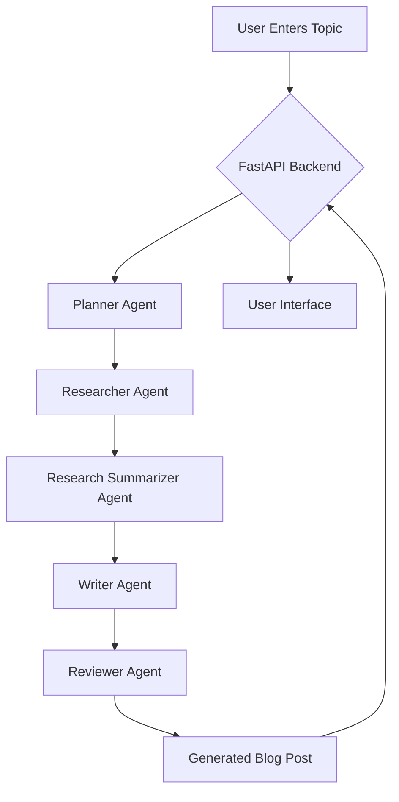

# Blog Post Factory

This project is a multi-agent system for creating blog posts. It uses a series of AI agents to plan, research, write, and review a blog post on a given topic. The front-end is a simple web interface that allows users to enter a topic and see the generated blog post in real-time.

## Architecture

The application is built with a FastAPI backend and a simple HTML/CSS/JavaScript frontend. The core logic is implemented using `langgraph`, a library for building stateful, multi-agent applications with LLMs.

The backend exposes a single API endpoint (`/generate`) that takes a topic as input and streams the blog post generation process to the client using Server-Sent Events (SSE).

The blog post generation process is defined as a graph of nodes, where each node represents a specific task:

1.  **Planner:** Creates a blog post plan with an introduction, main sections, and a conclusion.
2.  **Researcher:** Searches for information on the topic using the DuckDuckGo search API.
3.  **Research Summarizer:** Summarizes the research results to extract the key information.
4.  **Writer:** Writes the blog post based on the plan and the summarized research.
5.  **Reviewer:** Proofreads and polishes the blog post.

The application uses the `gemma3:4b` model from Ollama by default, but this can be configured in the `blog_post_factory/graph.py` file.

## Flow Diagram



## Installation

1.  **Clone the repository:**

    ```bash
    git clone https://github.com/your-username/blog-post-factory.git
    cd blog-post-factory
    ```

2.  **Install the dependencies:**

    ```bash
    pip install -r requirements.txt
    ```

3.  **Run the Ollama server:**

    Make sure you have Ollama installed and running. You can pull the `gemma3:4b` model with the following command:

    ```bash
    ollama pull gemma3:4b
    ```

4.  **Run the application:**

    ```bash
    python app.py
    ```

    The application will be available at `http://localhost:8001`.

## Usage

1.  Open your web browser and navigate to `http://localhost:8001`.
2.  Enter a topic for your blog post in the text area.
3.  Click the "Generate Blog Post" button.
4.  The blog post will be generated and displayed on the page in real-time.

## API Reference

### GET /generate

This endpoint generates a blog post on a given topic.

**Query Parameters:**

*   `topic` (string, required): The topic of the blog post.

**Responses:**

*   `200 OK`: The blog post is generated successfully. The response is a stream of Server-Sent Events.

## Contributing

Contributions are welcome! Please feel free to open an issue or submit a pull request.
